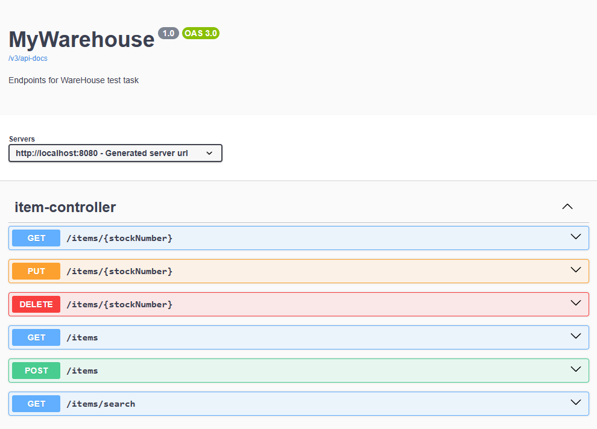
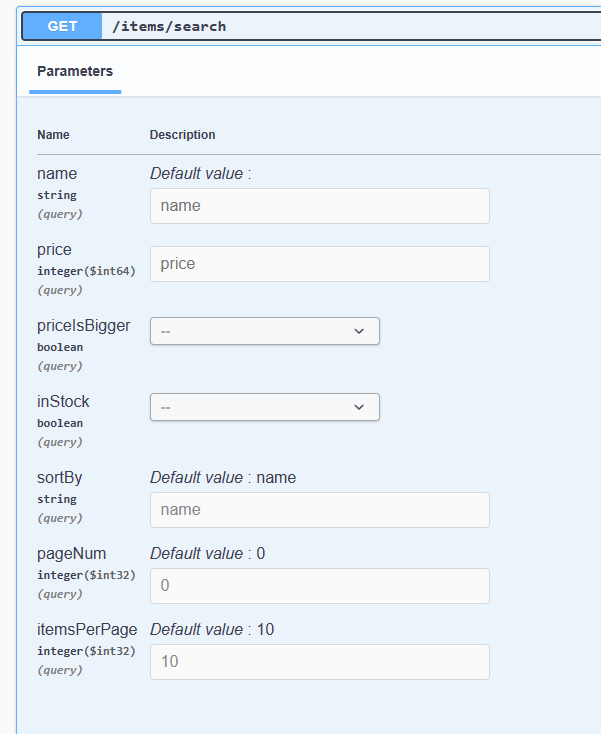

# MyWarehouse
Для запуска приложения:
Для запуска приложения:
1. Соберите war файл: maven clean compile
2. Запустить Docker на компьюере
3. Запустить docker-compose.yml файл
4. Запустите MyWarehouseApplication

Все эндпоинты представлены ниже, а также доступны по "/swagger-ui/index.html".

Чтобы добавить новый товар или обновить имеющийся необходимо передать в теле JSON объект типа:

    {
      "stockNum": "097796",
      "name": "string",
      "description": "string",
      "price": 0,
      "inStock": true
    }

Для осуществления поиска необходимо выполнить следующий запрос:

name - наименование товара
price - цена товара
priceIsBigger - true если больше указанной цены, false если меньше
inStock - в наличие или нет
sortBy - по какому параметру сортировка
pageNum - номер страницы
itemsPerPage - количество товаров на странице
